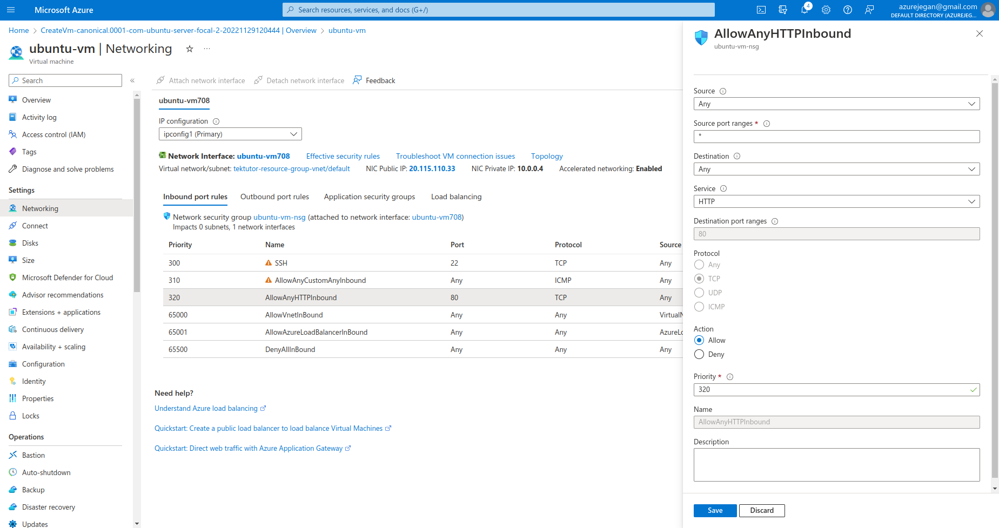

# Day 2

## Login to a specific azure subscription while automating infrastructure
<pre>
terraform {
    required_providers {
        azurerm = {
            source = "hashicorp/azurerm"
            version = "3.33.0"
        }   
    }   
}

provider "azurerm" {
    features {}

    subscription_id = "your-azure-subscription-id"
    tenant_id = "your-azure-tenantid"
}
</pre>

You may then try 
```
terraform init
terraform apply --auto-approve
```


## In case az login isn't popping up your azure login page in a web browser, you may try this
```
az login --use-device-code
```
The above command will display the URL and a code. You may manually open the URL and submit the code displayed to login.  This might also be helpful in case you are using putty or similar terminal utility in text mode.

## ⛹️‍♂️ Lab - Understanding count loop
```
cd ~/terraform-28Nov-02Dec-2022
git pull
cd Day2/loops

terraform init
terraform apply --auto-approve
```


## ⛹️‍♂️ Lab - Installing nginx web server on the Azure VM created manually
```
sudo apt update && sudo apt install -y nginx
curl localhost
```

Expected output
```
azureuser@ubuntu-vm:~$ <b>curl localhost</b>
<!DOCTYPE html>
<html>
<head>
<title>Welcome to nginx!</title>
<style>
    body {
        width: 35em;
        margin: 0 auto;
        font-family: Tahoma, Verdana, Arial, sans-serif;
    }
</style>
</head>
<body>
<h1>Welcome to nginx!</h1>
<p>If you see this page, the nginx web server is successfully installed and
working. Further configuration is required.</p>

<p>For online documentation and support please refer to
<a href="http://nginx.org/">nginx.org</a>.<br/>
Commercial support is available at
<a href="http://nginx.com/">nginx.com</a>.</p>

<p><em>Thank you for using nginx.</em></p>
</body>
</html>
```

In order to access the above web page from your local machine over Internet,  you need to open port 80 on the Virtual machine's firewall as shown below



## Lab - Creating a Ubuntu Virtual Machine using Terraform in Azure portal
```
cd ~/terraform-28Nov-02Dec-2022
git pull
cd Day2/create-azure-vm-using-terraform

terraform init
terraform apply --auto-approve
```

Expected output
<pre>
(jegan@tektutor.org)$ terraform apply --auto-approve

Terraform used the selected providers to generate the following execution plan. Resource actions are indicated with the
following symbols:
  + create

Terraform will perform the following actions:

  # azurerm_linux_virtual_machine.my_ubuntu_vm will be created
  + resource "azurerm_linux_virtual_machine" "my_ubuntu_vm" {
      + admin_username                  = "azureuser"
      + allow_extension_operations      = true
      + computer_name                   = "myvm"
      + disable_password_authentication = true
      + extensions_time_budget          = "PT1H30M"
      + id                              = (known after apply)
      + location                        = "eastus"
      + max_bid_price                   = -1
      + name                            = "my_ubuntu_vm"
      + network_interface_ids           = (known after apply)
      + patch_assessment_mode           = "ImageDefault"
      + patch_mode                      = "ImageDefault"
      + platform_fault_domain           = -1
      + priority                        = "Regular"
      + private_ip_address              = (known after apply)
      + private_ip_addresses            = (known after apply)
      + provision_vm_agent              = true
      + public_ip_address               = (known after apply)
      + public_ip_addresses             = (known after apply)
      + resource_group_name             = "tektutor-resource-group"
      + size                            = "Standard_DS1_V2"
      + virtual_machine_id              = (known after apply)

      + admin_ssh_key {
          + public_key = (known after apply)
          + username   = "azureuser"
        }

      + os_disk {
          + caching                   = "ReadWrite"
          + disk_size_gb              = (known after apply)
          + name                      = "my_harddisk"
          + storage_account_type      = "Premium_LRS"
          + write_accelerator_enabled = false
        }

      + source_image_reference {
          + offer     = "UbuntuServer"
          + publisher = "Canonical"
          + sku       = "18.04-LTS"
          + version   = "latest"
        }

      + termination_notification {
          + enabled = (known after apply)
          + timeout = (known after apply)
        }
    }

  # azurerm_network_interface.my_nic will be created
  + resource "azurerm_network_interface" "my_nic" {
      + applied_dns_servers           = (known after apply)
      + dns_servers                   = (known after apply)
      + enable_accelerated_networking = false
      + enable_ip_forwarding          = false
      + id                            = (known after apply)
      + internal_dns_name_label       = (known after apply)
      + internal_domain_name_suffix   = (known after apply)
      + location                      = "eastus"
      + mac_address                   = (known after apply)
      + name                          = "my_nic"
      + private_ip_address            = (known after apply)
      + private_ip_addresses          = (known after apply)
      + resource_group_name           = "tektutor-resource-group"
      + virtual_machine_id            = (known after apply)

      + ip_configuration {
          + gateway_load_balancer_frontend_ip_configuration_id = (known after apply)
          + name                                               = "my_nic_configuration"
          + primary                                            = (known after apply)
          + private_ip_address                                 = (known after apply)
          + private_ip_address_allocation                      = "Dynamic"
          + private_ip_address_version                         = "IPv4"
          + public_ip_address_id                               = (known after apply)
          + subnet_id                                          = (known after apply)
        }
    }

  # azurerm_network_interface_security_group_association.nic_nsg_connector will be created
  + resource "azurerm_network_interface_security_group_association" "nic_nsg_connector" {
      + id                        = (known after apply)
      + network_interface_id      = (known after apply)
      + network_security_group_id = (known after apply)
    }

  # azurerm_network_security_group.my_nsg will be created
  + resource "azurerm_network_security_group" "my_nsg" {
      + id                  = (known after apply)
      + location            = "eastus"
      + name                = "my_nsg"
      + resource_group_name = "tektutor-resource-group"
      + security_rule       = [
          + {
              + access                                     = "Allow"
              + description                                = ""
              + destination_address_prefix                 = "*"
              + destination_address_prefixes               = []
              + destination_application_security_group_ids = []
              + destination_port_range                     = "*"
              + destination_port_ranges                    = []
              + direction                                  = "Inbound"
              + name                                       = "AllowHttp"
              + priority                                   = 1003
              + protocol                                   = "Tcp"
              + source_address_prefix                      = "*"
              + source_address_prefixes                    = []
              + source_application_security_group_ids      = []
              + source_port_range                          = "80"
              + source_port_ranges                         = []
            },
          + {
              + access                                     = "Allow"
              + description                                = ""
              + destination_address_prefix                 = "*"
              + destination_address_prefixes               = []
              + destination_application_security_group_ids = []
              + destination_port_range                     = "*"
              + destination_port_ranges                    = []
              + direction                                  = "Inbound"
              + name                                       = "AllowICMP"
              + priority                                   = 1002
              + protocol                                   = "Icmp"
              + source_address_prefix                      = "*"
              + source_address_prefixes                    = []
              + source_application_security_group_ids      = []
              + source_port_range                          = "*"
              + source_port_ranges                         = []
            },
          + {
              + access                                     = "Allow"
              + description                                = ""
              + destination_address_prefix                 = "*"
              + destination_address_prefixes               = []
              + destination_application_security_group_ids = []
              + destination_port_range                     = "22"
              + destination_port_ranges                    = []
              + direction                                  = "Inbound"
              + name                                       = "AllowSSH"
              + priority                                   = 1001
              + protocol                                   = "Tcp"
              + source_address_prefix                      = "*"
              + source_address_prefixes                    = []
              + source_application_security_group_ids      = []
              + source_port_range                          = "*"
              + source_port_ranges                         = []
            },
        ]
    }

  # azurerm_public_ip.my_public_ip will be created
  + resource "azurerm_public_ip" "my_public_ip" {
      + allocation_method       = "Dynamic"
      + ddos_protection_mode    = "VirtualNetworkInherited"
      + fqdn                    = (known after apply)
      + id                      = (known after apply)
      + idle_timeout_in_minutes = 4
      + ip_address              = (known after apply)
      + ip_version              = "IPv4"
      + location                = "eastus"
      + name                    = "my_public_ip"
      + resource_group_name     = "tektutor-resource-group"
      + sku                     = "Basic"
      + sku_tier                = "Regional"
    }

  # azurerm_resource_group.rg will be created
  + resource "azurerm_resource_group" "rg" {
      + id       = (known after apply)
      + location = "eastus"
      + name     = "tektutor-resource-group"
    }

  # azurerm_subnet.my_subnet will be created
  + resource "azurerm_subnet" "my_subnet" {
      + address_prefixes                               = [
          + "10.0.1.0/24",
        ]
      + enforce_private_link_endpoint_network_policies = (known after apply)
      + enforce_private_link_service_network_policies  = (known after apply)
      + id                                             = (known after apply)
      + name                                           = "my_subnet"
      + private_endpoint_network_policies_enabled      = (known after apply)
      + private_link_service_network_policies_enabled  = (known after apply)
      + resource_group_name                            = "tektutor-resource-group"
      + virtual_network_name                           = "my-virtual-net"
    }

  # azurerm_virtual_network.my_virtual_network will be created
  + resource "azurerm_virtual_network" "my_virtual_network" {
      + address_space       = [
          + "10.0.0.0/16",
        ]
      + dns_servers         = (known after apply)
      + guid                = (known after apply)
      + id                  = (known after apply)
      + location            = "eastus"
      + name                = "my-virtual-net"
      + resource_group_name = "tektutor-resource-group"
      + subnet              = (known after apply)
    }

  # tls_private_key.my_ssh_key will be created
  + resource "tls_private_key" "my_ssh_key" {
      + algorithm                     = "RSA"
      + ecdsa_curve                   = "P224"
      + id                            = (known after apply)
      + private_key_openssh           = (sensitive value)
      + private_key_pem               = (sensitive value)
      + private_key_pem_pkcs8         = (sensitive value)
      + public_key_fingerprint_md5    = (known after apply)
      + public_key_fingerprint_sha256 = (known after apply)
      + public_key_openssh            = (known after apply)
      + public_key_pem                = (known after apply)
      + rsa_bits                      = 4096
    }

Plan: 9 to add, 0 to change, 0 to destroy.

Changes to Outputs:
  + public_ip_address = (known after apply)
  + ssh_key           = (sensitive value)
tls_private_key.my_ssh_key: Creating...
tls_private_key.my_ssh_key: Creation complete after 2s [id=8398aabea189bc0449598194095733e0a65fb4e1]
azurerm_resource_group.rg: Creating...
azurerm_resource_group.rg: Creation complete after 6s [id=/subscriptions/6ee542a8-0314-472f-a628-625cfbfcc778/resourceGroups/tektutor-resource-group]
azurerm_virtual_network.my_virtual_network: Creating...
azurerm_public_ip.my_public_ip: Creating...
azurerm_network_security_group.my_nsg: Creating...
azurerm_public_ip.my_public_ip: Creation complete after 10s [id=/subscriptions/6ee542a8-0314-472f-a628-625cfbfcc778/resourceGroups/tektutor-resource-group/providers/Microsoft.Network/publicIPAddresses/my_public_ip]
azurerm_network_security_group.my_nsg: Creation complete after 10s [id=/subscriptions/6ee542a8-0314-472f-a628-625cfbfcc778/resourceGroups/tektutor-resource-group/providers/Microsoft.Network/networkSecurityGroups/my_nsg]
azurerm_virtual_network.my_virtual_network: Still creating... [10s elapsed]
azurerm_virtual_network.my_virtual_network: Creation complete after 12s [id=/subscriptions/6ee542a8-0314-472f-a628-625cfbfcc778/resourceGroups/tektutor-resource-group/providers/Microsoft.Network/virtualNetworks/my-virtual-net]
azurerm_subnet.my_subnet: Creating...
azurerm_subnet.my_subnet: Creation complete after 9s [id=/subscriptions/6ee542a8-0314-472f-a628-625cfbfcc778/resourceGroups/tektutor-resource-group/providers/Microsoft.Network/virtualNetworks/my-virtual-net/subnets/my_subnet]
azurerm_network_interface.my_nic: Creating...
azurerm_network_interface.my_nic: Creation complete after 9s [id=/subscriptions/6ee542a8-0314-472f-a628-625cfbfcc778/resourceGroups/tektutor-resource-group/providers/Microsoft.Network/networkInterfaces/my_nic]
azurerm_network_interface_security_group_association.nic_nsg_connector: Creating...
azurerm_linux_virtual_machine.my_ubuntu_vm: Creating...
azurerm_network_interface_security_group_association.nic_nsg_connector: Creation complete after 4s [id=/subscriptions/6ee542a8-0314-472f-a628-625cfbfcc778/resourceGroups/tektutor-resource-group/providers/Microsoft.Network/networkInterfaces/my_nic|/subscriptions/6ee542a8-0314-472f-a628-625cfbfcc778/resourceGroups/tektutor-resource-group/providers/Microsoft.Network/networkSecurityGroups/my_nsg]
azurerm_linux_virtual_machine.my_ubuntu_vm: Still creating... [10s elapsed]
azurerm_linux_virtual_machine.my_ubuntu_vm: Still creating... [20s elapsed]
azurerm_linux_virtual_machine.my_ubuntu_vm: Creation complete after 27s [id=/subscriptions/6ee542a8-0314-472f-a628-625cfbfcc778/resourceGroups/tektutor-resource-group/providers/Microsoft.Compute/virtualMachines/my_ubuntu_vm]

Apply complete! Resources: 9 added, 0 changed, 0 destroyed.

Outputs:

public_ip_address = "20.25.30.208"
ssh_key = <sensitive>
</pre>

Extracting the private key (pem file)
```
terraform output ssh_key > ./key.pem
chmod 400 ./key.pem
```

Try to SSH into the Virtual machine
```
ssh -i ./key.pem azureuser@20.25.30.208

sudo apt update && sudo apt install -y nginx
curl http://localhost
exit
```

Expected output
<pre>
(jegan@tektutor.org)$ ssh -i ./key.pem azureuser@20.25.30.208
The authenticity of host '20.25.30.208 (20.25.30.208)' can't be established.
ECDSA key fingerprint is SHA256:Z1UE8ivYJiOgjGMAuhUkoZWyo0cD3tX1qr+YxqK5/E8.
Are you sure you want to continue connecting (yes/no)? yes
Warning: Permanently added '20.25.30.208' (ECDSA) to the list of known hosts.
Welcome to Ubuntu 18.04.6 LTS (GNU/Linux 5.4.0-1094-azure x86_64)

 * Documentation:  https://help.ubuntu.com
 * Management:     https://landscape.canonical.com
 * Support:        https://ubuntu.com/advantage

  System information as of Tue Nov 29 09:13:03 UTC 2022

  System load:  0.15              Processes:           110
  Usage of /:   4.8% of 28.89GB   Users logged in:     0
  Memory usage: 5%                IP address for eth0: 10.0.1.4
  Swap usage:   0%

0 updates can be applied immediately.


The programs included with the Ubuntu system are free software;
the exact distribution terms for each program are described in the
individual files in /usr/share/doc/*/copyright.

Ubuntu comes with ABSOLUTELY NO WARRANTY, to the extent permitted by
applicable law.

To run a command as administrator (user "root"), use "sudo <command>".
See "man sudo_root" for details.

azureuser@myvm:~$ exit
</pre>

Check if the firewall rules we created are working
```
curl http://20.25.30.208
ping 20.25.30.208
```
