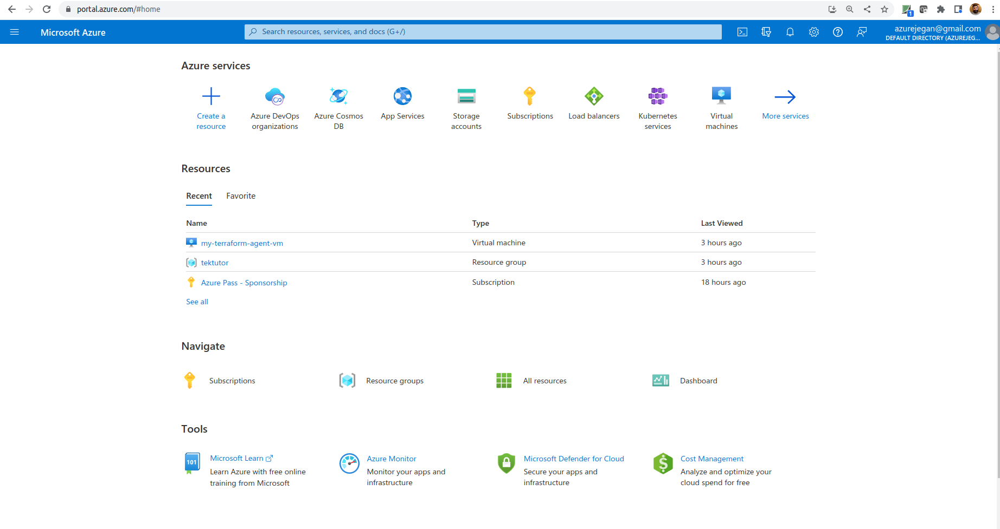

# Day 5

## Microsoft Azure self-host agent binaries
```
https://github.com/Microsoft/azure-pipelines-agent/releases
```

## Azure App Service Plan SKU
<pre>
Free Tier → F1
Shared Tier → D1
Basic Tier → B1, B2, B3 (Basic Small, Medium, Large)
Standard Tier → S1, S2, S3 (Small, Medium, Large)
PremiumV2 Tier → P1v2, P2v2, P3v2 (Small, Medium, Large)
</pre>

## What is Continuous Integration (CI)?
- the code you wrote is integrated with dev branch several times a day, which triggers a build and automated test execution
- this ensures your code commit hasn't broken any existing functions as it runs your newly added test cases and existing test cases
- this is a fail-fast approach followed in teams that follow any Agile Frameworks( SCRUM, Kanban, XP, etc., )

## What is Continuous Delivery (CD)?
- is an extension of Continuous Integration (CI) since it automatically deploys all code changes to a testing and/or production environment after the build stage. 

- deploying and testing in multiple environments improves quality

## What is Continuous Deployment (CD)?
- goes one step further than continuous delivery
- With this practice, every change that passes all stages of your production pipeline is released to your customers 
- There's no human intervention, and only a failed test will prevent a new change to be deployed to production

## What is DevOps?
- is the combination of cultural philosophies, practices, and tools that increases an organization’s ability to deliver applications and services at high velocity
- enables organizations to better serve their customers and compete more effectively in the market

## Getting familiar with Azure Pipeline Jargons
- Azure Pipeline
- Stage
- Steps
- Trigger
- Job
- Agent
- Task
- Artifact

## What is Azure Pipeline?
- automatically builds and tests code projects to make them available to others
- it supports almost any programming language 
- combines continuous integration (CI) and continuous delivery (CD) to test and build your code and ship it to any target

## Azure Self-hosted agent binaries for all supported Operating Systems can be found here
<pre>
https://github.com/Microsoft/azure-pipelines-agent/releases
</pre>

## Lab - Manually creating a self-hosted Azure Pipeline Linux agent to run Terraform scripts

#### Create a Personal Access Token
From your Azure portal, search for "Azure DevOps organizations" and click the same


You will see below page now, click on "My Azure DevOps Organizations"


Click on "Create new organization"

Once you have created your new organization, create a Personal Access Token with Full access and save the token in your system in some text file.  This token will be required to register your self-hosted pipeline agent with your project.


1. Provision an Ubuntu 20.04 Virtual Machine in your azure portal.
2. Install azure cli, terraform cli and ansible
```
sudo apt update
sudo apt install -y git ansible tree vim docker.io azure-cli default-jdk maven 
sudo snap install terraform --classic
sudo usermod -aG docker $USER
sudo su azureuser
docker images
```

Verify if maven version works
```
mvn --version
ls -l /usr/lib/jvm/java-11-openjdk-amd64/bin 
```
Expected output
<pre>
Apache Maven 3.6.3
Maven home: /usr/share/maven
Java version: 11.0.17, vendor: Ubuntu, runtime: /usr/lib/jvm/java-11-openjdk-amd64
Default locale: en, platform encoding: UTF-8
OS name: "linux", version: "5.15.0-1023-azure", arch: "amd64", family: "unix"
azureuser@linux-selfhosted-agent:~$ ls -l /usr/lib/jvm/java-11-openjdk-amd64/bin
total 624
-rwxr-xr-x 1 root root  14632 Oct 25 09:30 jaotc
-rwxr-xr-x 1 root root  14576 Oct 25 09:30 jar
-rwxr-xr-x 1 root root  14576 Oct 25 09:30 jarsigner
-rwxr-xr-x 1 root root  14560 Oct 25 09:30 java
-rwxr-xr-x 1 root root  14608 Oct 25 09:30 javac
-rwxr-xr-x 1 root root  14608 Oct 25 09:30 javadoc
-rwxr-xr-x 1 root root  14576 Oct 25 09:30 javap
-rwxr-xr-x 1 root root  14576 Oct 25 09:30 jcmd
-rwxr-xr-x 1 root root  14624 Oct 25 09:30 jconsole
-rwxr-xr-x 1 root root  14576 Oct 25 09:30 jdb
-rwxr-xr-x 1 root root  14576 Oct 25 09:30 jdeprscan
-rwxr-xr-x 1 root root  14576 Oct 25 09:30 jdeps
-rwxr-xr-x 1 root root  14576 Oct 25 09:30 jfr
-rwxr-xr-x 1 root root  14576 Oct 25 09:30 jhsdb
-rwxr-xr-x 1 root root  14576 Oct 25 09:30 jimage
-rwxr-xr-x 1 root root  14608 Oct 25 09:30 jinfo
-rwxr-xr-x 1 root root  14608 Oct 25 09:30 jjs
-rwxr-xr-x 1 root root  14608 Oct 25 09:30 jlink
-rwxr-xr-x 1 root root  14608 Oct 25 09:30 jmap
-rwxr-xr-x 1 root root  14576 Oct 25 09:30 jmod
-rwxr-xr-x 1 root root  14576 Oct 25 09:30 jps
-rwxr-xr-x 1 root root  14608 Oct 25 09:30 jrunscript
-rwxr-xr-x 1 root root  14576 Oct 25 09:30 jshell
-rwxr-xr-x 1 root root  14608 Oct 25 09:30 jstack
-rwxr-xr-x 1 root root  14576 Oct 25 09:30 jstat
-rwxr-xr-x 1 root root  14576 Oct 25 09:30 jstatd
-rwxr-xr-x 1 root root  14576 Oct 25 09:30 keytool
-rwxr-xr-x 1 root root  14576 Oct 25 09:30 pack200
-rwxr-xr-x 1 root root  14576 Oct 25 09:30 rmic
-rwxr-xr-x 1 root root  14576 Oct 25 09:30 rmid
-rwxr-xr-x 1 root root  14576 Oct 25 09:30 rmiregistry
-rwxr-xr-x 1 root root  14576 Oct 25 09:30 serialver
-rwxr-xr-x 1 root root 111664 Oct 25 09:30 unpack200
</pre>

Checking the docker service status
```
sudo systemctl status docker
```

3. From the terminal, type the below command, copy the code and paste the code on the web page that popped up and login to your azure portal to authenticate.
```
az login
```
Copy the credentials details in some file for your future reference.


4. Install the below from terminal to configure the Azure Ubuntu VM as a self-hosted Azure Pipline agent
```
mkdir myagent && cd myagent
wget https://vstsagentpackage.azureedge.net/agent/2.213.2/vsts-agent-linux-x64-2.213.2.tar.gz
tar zxvf vsts-agent-linux-x64-2.213.2.tar.gz
ls
./config.sh
./run.sh
```

Expected output
<pre>
azureuser@my-terraform-agent-vm:~/myagent$ <b>ls</b>
bin  config.sh  env.sh  externals  license.html  run-docker.sh  run.sh  vsts-agent-linux-x64-2.213.2.tar.gz
azureuser@my-terraform-agent-vm:~/myagent$ <b>./config.sh</b>

  ___                      ______ _            _ _
 / _ \                     | ___ (_)          | (_)
/ /_\ \_____   _ _ __ ___  | |_/ /_ _ __   ___| |_ _ __   ___  ___
|  _  |_  / | | | '__/ _ \ |  __/| | '_ \ / _ \ | | '_ \ / _ \/ __|
| | | |/ /| |_| | | |  __/ | |   | | |_) |  __/ | | | | |  __/\__ \
\_| |_/___|\__,_|_|  \___| \_|   |_| .__/ \___|_|_|_| |_|\___||___/
                                   | |
        agent v2.213.2             |_|          (commit 4f90e68)


>> End User License Agreements:

Building sources from a TFVC repository requires accepting the Team Explorer Everywhere End User License Agreement. This step is not required for building sources from Git repositories.

A copy of the Team Explorer Everywhere license agreement can be found at:
  /home/azureuser/myagent/license.html

Enter (Y/N) Accept the Team Explorer Everywhere license agreement now? (press enter for N) > <b>N</b>

>> Connect:

Enter server URL > https://dev.azure.com/azurejegan
Enter authentication type (press enter for PAT) > 
Enter personal access token > ****************************************************
Connecting to server ...

>> Register Agent:

Enter agent pool (press enter for default) > 
Enter agent name (press enter for my-terraform-agent-vm) > 
Scanning for tool capabilities.
Connecting to the server.
Successfully added the agent
Testing agent connection.
Enter work folder (press enter for _work) > 
2022-11-24 23:37:14Z: Settings Saved.

azureuser@my-terraform-agent-vm:~/myagent$ <b>./run.sh</b>
Scanning for tool capabilities.
Connecting to the server.
2022-11-25 00:15:55Z: Listening for Jobs
</pre>

## ⛹️‍♀️ Lab - Creating a Linux Self Host Azure pipeline agent
```
export AZDO_PERSONAL_ACCESS_TOKEN=<Personal Access Token>
export AZDO_ORG_SERVICE_URL=https://dev.azure.com/<Your Org Name>

cd ~/terraform-28nov-02dec-2022
git pull

cd Day5/self-hosted-azure-pipeline-linux-agent
terraform init
terraform apply --auto-approve
```

In case you wish to get inside the container for troubleshooting 
```
az container exec --resource-group tektutor-resource-group --container-name linux-agent-0 --name linux-agent-0 --exec-command "/bin/bash"
```
Expected output
```
(jegan@tektutor.org)$ <b>az container exec --resource-group tektutor-resource-group --container-name linux-agent-0 --name linux-agent-0 --exec-command "/bin/bash"</b>
root@SandboxHost-638055415862234554:/azp# <b>ls</b>
agent  start.sh
root@SandboxHost-638055415862234554:/azp# exit
exit
```

## ⛹️‍♂️ Lab - Creating a Windows Self Host Azure pipeline agent
```
export AZDO_PERSONAL_ACCESS_TOKEN=<Personal Access Token>
export AZDO_ORG_SERVICE_URL=https://dev.azure.com/<Your Org Name>

cd ~/terraform-28nov-02dec-2022
git pull

cd Day5/self-hosted-azure-pipeline-windows-agent
terraform init
terraform apply --auto-approve
```
